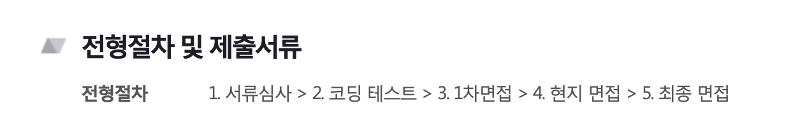

<div class="toc-title">Table of Contents</div>

```toc
# This code block gets replaced with the TOC
exclude: Table of Contents
tight: false
ordered: false
from-heading: 2
to-heading: 3
class-name: "table-of-contents"
```

<span style="color: gray; margin-top: 12px;">
  굉장히 주관적인 글이라 단순 참고하시면 감사합니다. 저의 일본 생활은 2019.04 ~ 2021.12 로 현제 작성하는 시점에서는
  이미 귀국을 한 이후에 기록하고자 남깁니다.
</span>

## 어떻게 해서 일본갔어?

저는 일본 취업에대해서 고민한적도 고려한적도 없는 개발을 좋아하는 대학생이었습니다.
대학생 3학년 2학기 방학을 어떻개 보낼까 고민하던 찰나 일본 기업에서의 인턴십 공고가 있었고
경비 지원과 경험을 제공하겠다라고 설명을 듣고 흥미로워 신청하였습니다.

(숙소, 비행기경비, 일본에서의 교통비, 월급 지원등을 지원받았습니다.)

<br/>

## 절차는?



<span style="color: gray; margin-top: 12px;">2019년도에는 2차면접도 온라인으로 진행하였습니다.</span>

- 코딩테스트는 틈틈이 준비하고 있었던 터라 무리 없을 정도였습니다.
- 문제는 면접이었습니다. 저의 일본은 듣기는 자신있었지만 말하기가 힘들었습니다.
<br/> 그래서 예상질문을 대부분 외워갔습니다. <br/>(저의 일본어가 의심 스러웠는지 2차는 영어로도 조금 대화를 했습니다.)

<br/>

## 선발결과
운이좋게 저에게 인턴십 참가 기회가 주어졌고 방학생활을 일본에서 보내게 되었습니다.

<br/>

## 인턴십 후기
회사에서 진행되는 업무 프로세스를 느낄 수 있었으며 애자일에 진심인 회사라는 것을 느꼈습니다.
특히 Redhat에 서포트를 받아 프로세스를 잡는 중이라 나름 체계적이다 라고 느꼈습니다.
분명 내가 성장할 수 있는공간이라고 느꼈습니다.
그리고 4학년 1학기 시작직전에 `내정`을 받았고 어학관련 지원을 받아 공부도 하며 일본에서의 생활을 준비하였습니다.

<br/>

## 끝으로 장단점 (TMI가 될 수 있습니다.)
정말 좋은 대우로 인턴십에 참가하였고 좋은경험으로 이어져 2019년 4월에 입사하였습니다.
한국이랑은 조금은 달라도 좋은 경험이었습니다. <br/><br/>

> 장점
>>
  - 내가 마음만 먹으면 여행과 같은 느낌을 받을 수 있다.
  - 휴일이 많았고 워라벨이 확실해서 좋았습니다.
  - 전체적인 개발 프로세스를 경험하였습니다.
  - 일본어라는 한 언어를 얻었습니다.

> 단점
>>
  - 주변에 지인이 없어서 문제가 생겼을때 힘들었습니다.
  - 지금의 개발 프로세스가 일반적인지 알 수 없습니다. (한국도 같을까 라는?)
  - 코로나 시국떄라 한국에 갈 수 없다는 점

<br/>
<br/>
