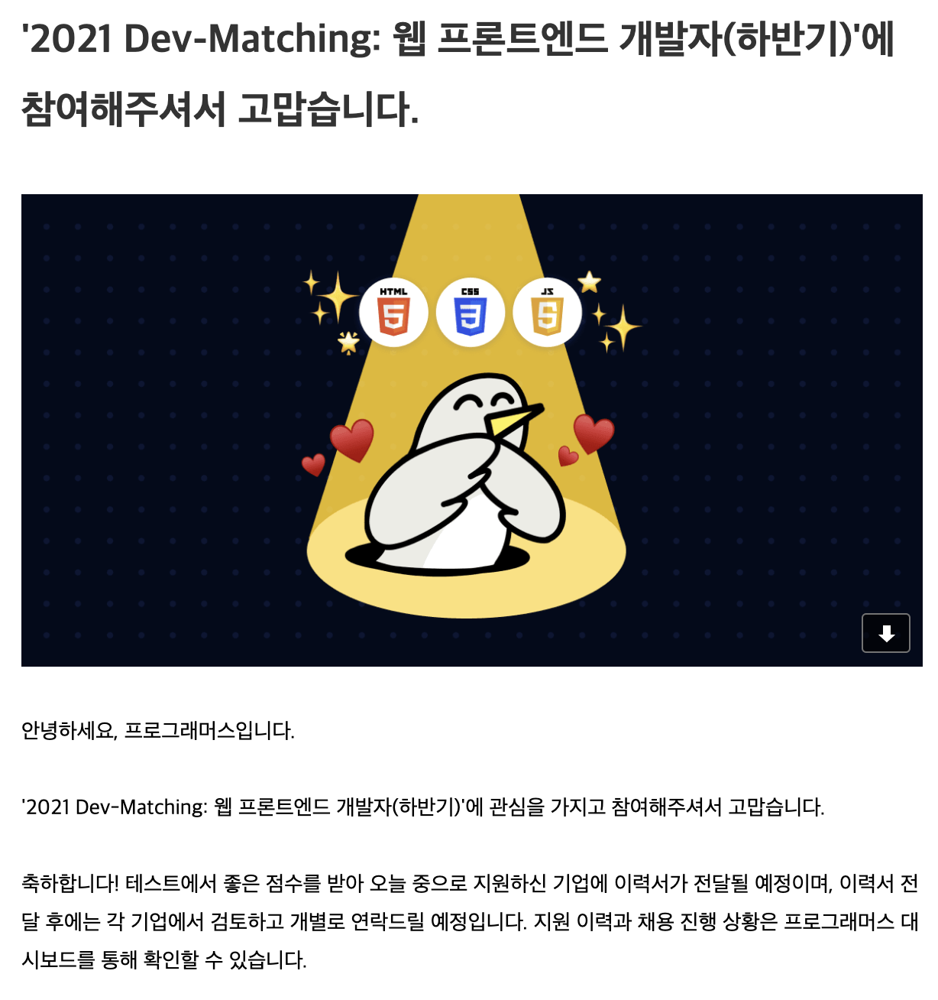

import { StaticImage } from "gatsby-plugin-image";

<div class="toc-title">Table of Contents</div>

```toc
# This code block gets replaced with the TOC
exclude: Table of Contents
tight: false
ordered: false
from-heading: 2
to-heading: 3
class-name: "table-of-contents"
```


## 후기

시험을 치뤄지는 환경은 웹 visual code에서 진행되어진다. 기본적인 서버 세팅은 갖춰져있으며 API도 준비가 되어져있다.
(심지어 css도...) 시험은 싱글페이지 어플리케이션을 vanilajs로 구현하는 것이다. 문제를 읽고 필요부분 구현을 하는 것이었다.
난이도는 중간 정도였다고 생각한다. 구현에 있어서 제약이 없는편이라 js를 휘갈길 능력이 된다면 누구나 구현 할 수 있다.
다만 시간싸움이 존재하기에 평소에 얼마나 js를 자유롭게 사용하느냐 싱글페이지를 구현할 수 있는가를 보는 시험인것 같다.


## 결과

오랜만에 vanilajs를 사용하여 구현하는것이 재미는 있었으나, 시간 부족으로 미구현 부분도 조금 존재하였다.

어쨌거나 결과는 합격...


<br/>
PS: 시험을 치는 개발자도 컨텍하는 회사도 사실 큰 흥미가 없는게 아닐까?라는 생각이든다.
가볍게 본인 js실력으로 웹 구현을 얼마나 할 수 있는지를 가늠해보고 싶다면 추천한다.
허나 회사랑 컨텍을하는 목적이라면 가볍게 하는것이 좋을 것 같다.<br/><br/>

코드는 혹시 문제가 공개된다면 깃허브로 공개하겠습니다.

혹시 궁금한 것이 있다면 질문 받습니다~
